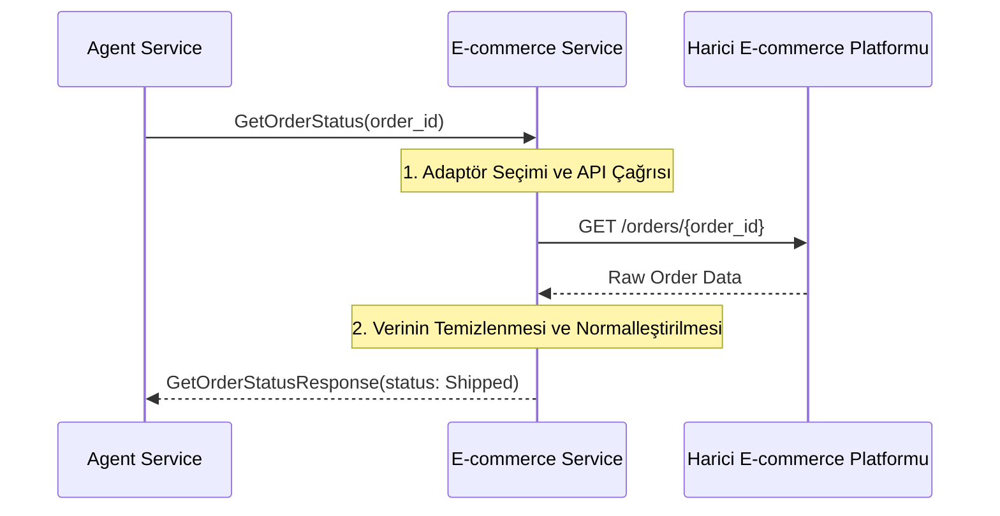

# 🛒 Sentiric Vertical E-commerce Service - Mantık ve Akış Mimarisi

**Stratejik Rol:** E-ticaret platformlarına (Shopify, Magento, Özel Veritabanları) özgü iş mantığını ve sorgularını soyutlar. Agent'ın müşterinin sipariş geçmişi ve ürün bilgileri hakkında bilgi almasını sağlar.

---

## 1. Temel Akış: Sipariş Durumu Sorgulama (GetOrderStatus)

## 2. İş Mantığı Alanları

* Platform Adaptasyonu: Shopify API'si, Amazon Seller API'si gibi farklı platformların API çağrılarını tek bir GetOrderStatus RPC'si altında birleştirir.
* Güvenlik: Sadece yetkili tenant_id ve user_id için sipariş bilgilerine erişim sağlar.
