# 🛒 Sentiric Vertical E-commerce Service - Mantık ve Akış Mimarisi

**Stratejik Rol:** E-ticaret platformlarına (Shopify, Magento, Özel Veritabanları) özgü iş mantığını ve sorgularını soyutlar. Agent'ın müşterinin sipariş geçmişi ve ürün bilgileri hakkında bilgi almasını sağlar.

---

## 1. Temel Akış: Sipariş Durumu Sorgulama (GetOrderStatus)

```mermaid
sequenceDiagram
    participant Agent as Agent Service
    participant VES as E-commerce Service
    participant Shopify as Harici E-commerce Platformu
    
    Agent->>VES: GetOrderStatus(order_id)
    
    Note over VES: 1. Adaptör Seçimi ve API Çağrısı
    VES->>Shopify: GET /orders/{order_id}
    Shopify-->>VES: Raw Order Data
    
    Note over VES: 2. Verinin Temizlenmesi ve Normalleştirilmesi
    VES-->>Agent: GetOrderStatusResponse(status: Shipped)
```

## 2. İş Mantığı Alanları

* Platform Adaptasyonu: Shopify API'si, Amazon Seller API'si gibi farklı platformların API çağrılarını tek bir GetOrderStatus RPC'si altında birleştirir.
* Güvenlik: Sadece yetkili tenant_id ve user_id için sipariş bilgilerine erişim sağlar.
